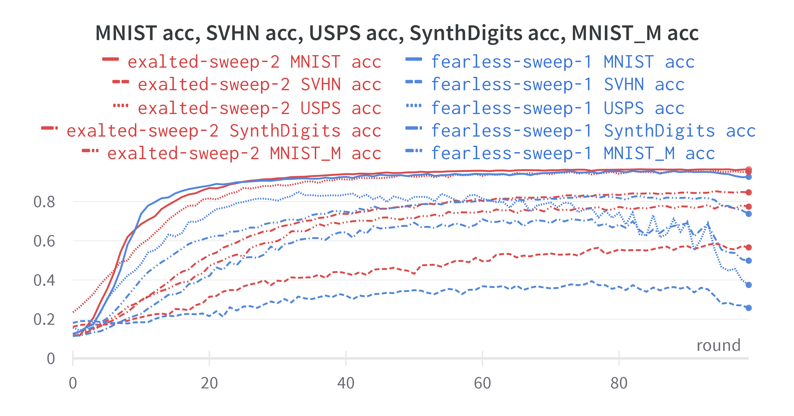
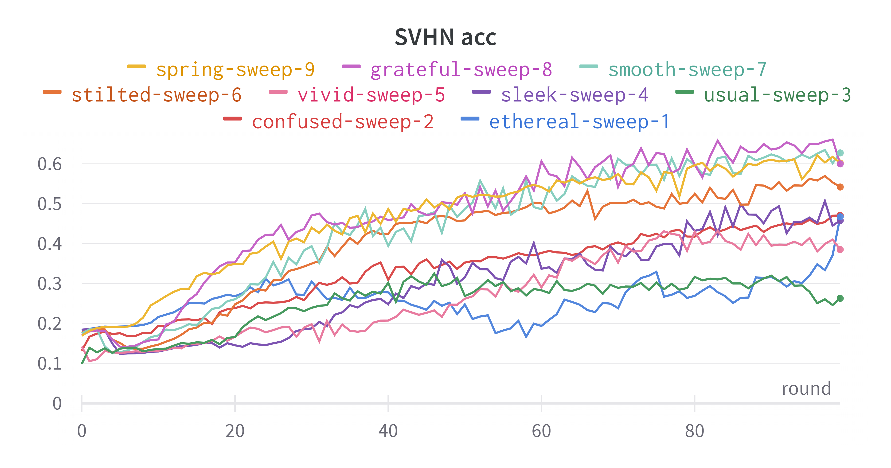
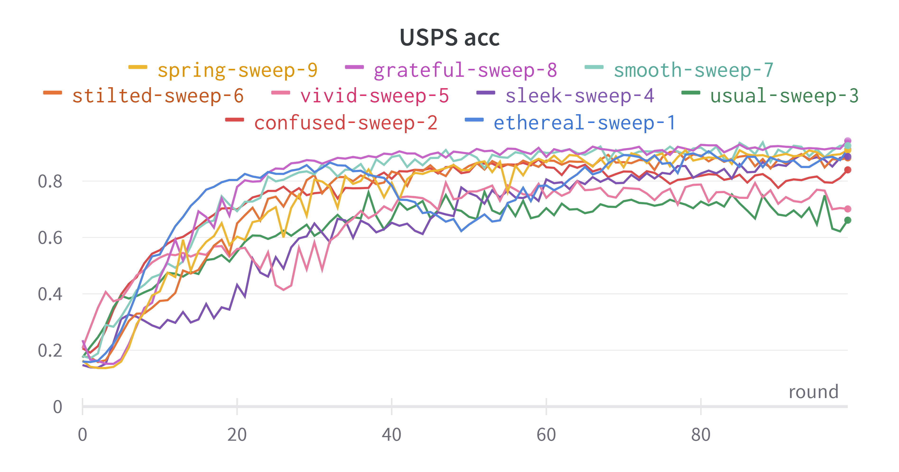
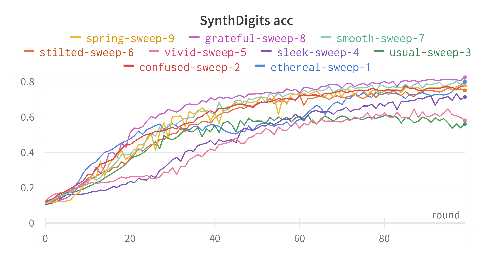
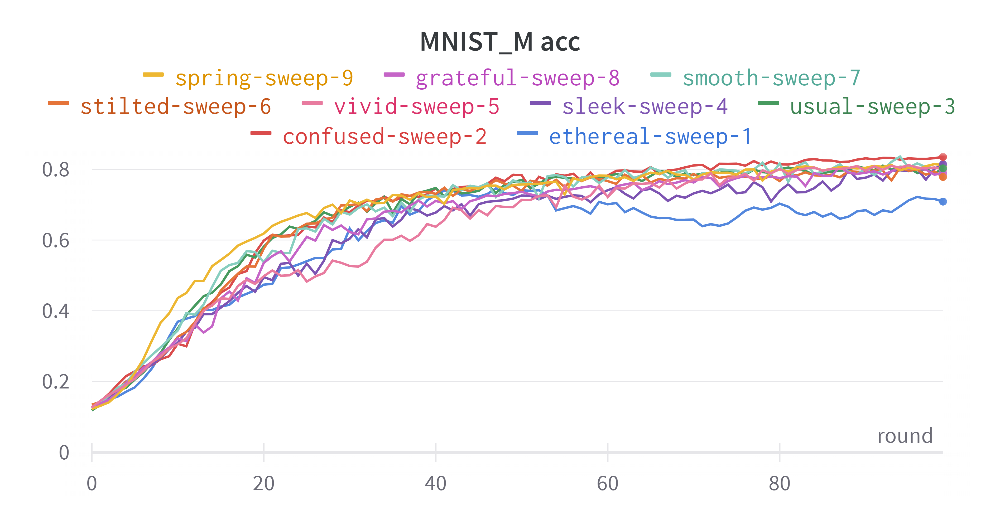

# GanSFL

> 实验数据集引用 "FedBN: Federated Learning on Non-IID Features via Local Batch Normalization" 中处理后的数据集。每个客户端所持有的数据集来自不同域（分别为 MNIST | SVHN | USPS | SynthDigits | MNIST_M）。

## GanSFL 与 SFL 的对比

> 目前添加了鉴别器后，模型收敛的性能反而变差了。[详细对比结果](https://wandb.ai/sjinglong/GanSFL/sweeps/8xi7zmmj?workspace=user-sjinglong)

## 在不同点切分模型对 GanSFL 的影响

> [详细对比结果](https://wandb.ai/sjinglong/GanSFL/sweeps/bt207pyr?workspace=user-sjinglong)

## 客户端数据集大小对 GanSFL 的影响

> [详细对比结果](https://wandb.ai/sjinglong/GanSFL/sweeps/1lod8gja?workspace=user-sjinglong)

## 判别器反向传播在客户端模型上的梯度的权重对 GanSFL 的影响

> [详细对比结果](https://wandb.ai/sjinglong/GanSFL/sweeps/54k1qtl0?workspace=user-sjinglong)

## 以不同 client 输出的 feature map 作为目标域对 GanSFL 的影响

> [详细对比结果](https://wandb.ai/sjinglong/GanSFL/sweeps/61s6lk59?workspace=user-sjinglong)